# Heng's `AirBnB` Clone: `Heng's CatBnB`

Catbnb is a web application for practicing web developent. It is inspired by Airbnb. It provides an online platform for cats to find and book their hang-out places.

## How to launch the full site:
[Heng's CatBnB](https://heng-catbnb.herokuapp.com/)

## Useful Links:
[Wiki of this Project](https://github.com/zerotume/full-clone-hengAirBnB/wiki)

[DB Schema](https://github.com/zerotume/full-clone-hengAirBnB/wiki/db)

[Features and Redux Store Shape](https://github.com/zerotume/full-clone-hengAirBnB/wiki/Features)

[API Routes](https://github.com/zerotume/full-clone-hengAirBnB/tree/master/backend#readme)

## The project is built with
* JavaScript
* PostgreSQL
* Sequelize
* Express
* React
* Redux
* Redux-thunk

## Features Directions:

### Index Page

You don't have to log in at this page.
For demo user, you can click the Demouser Login button in the profile menu.
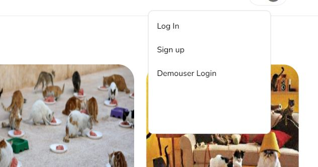

The route for main page is '/'
And '/spots' also works for the main page.
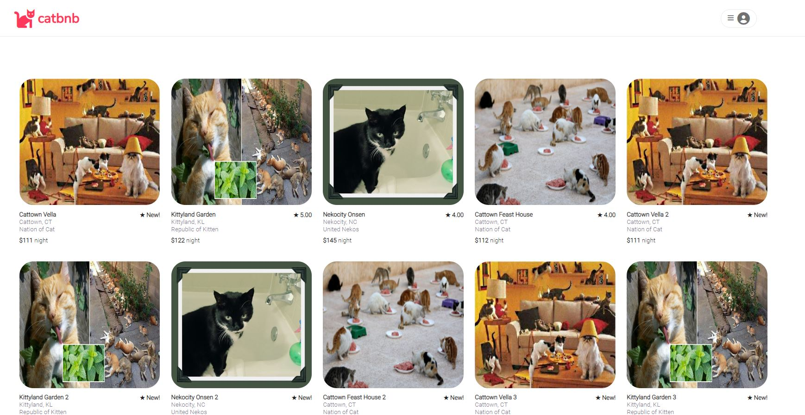
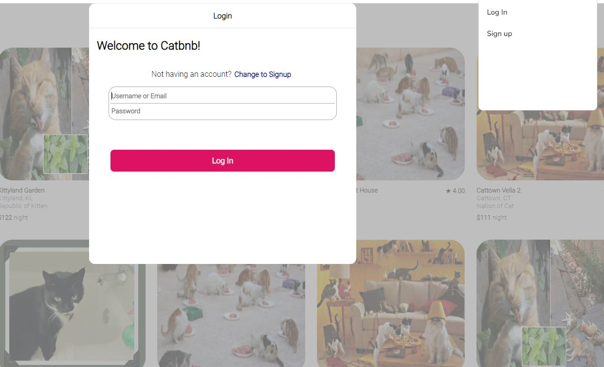

### Spot Detail

When you are logged in, you can click any spot card in the index page, and go to see the detail of a spot, including exist bookings.
The route for spot detail page is 'spots/:id'

Not owned spot:
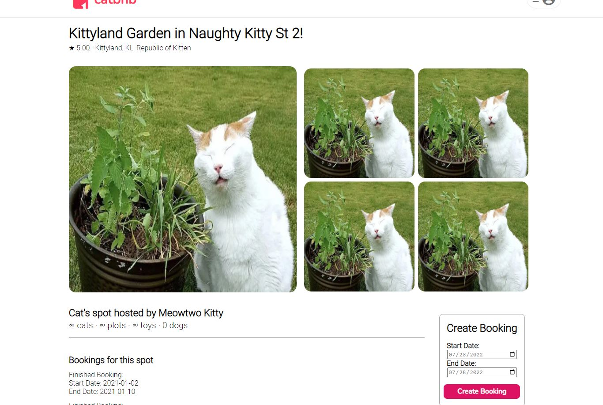

Owned spot:
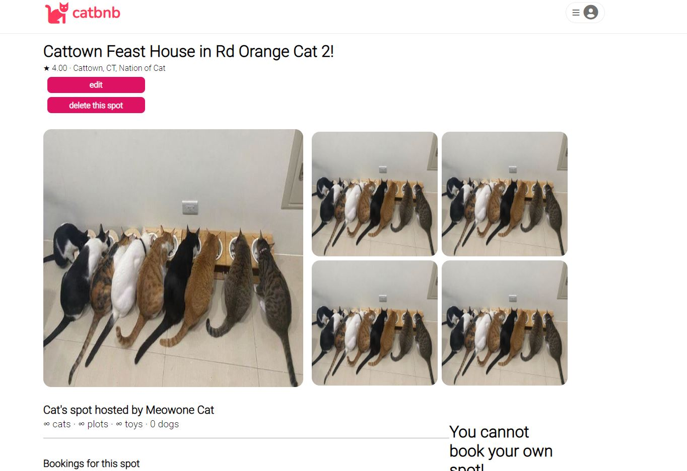

### My Spots

When you are logged in, you can go to "my Spots" page by clicking
"My Spots" in the profile menu.
The route for this page is '/spots/myspots'

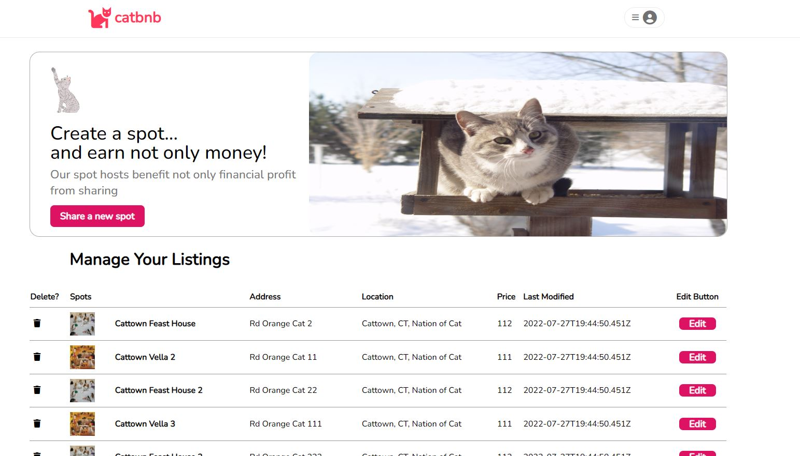

### Create a Spot

When you are logged in, you can go to "Create Spot" page by clicking the "Create a spot" button in the profile menu.
The route for this page is '/spots/newSpot'

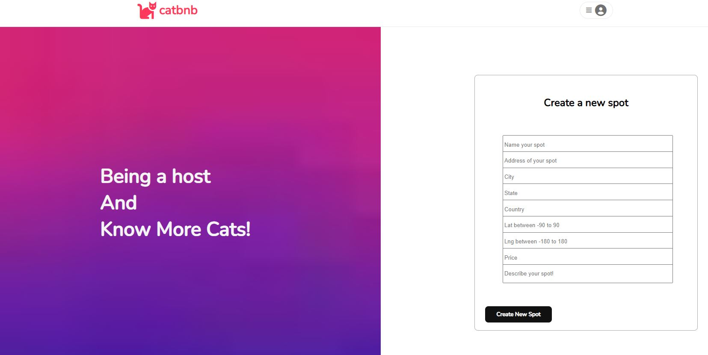

### Edit a Spot
When you are logged in, you can go to the "Edit Spot" page by clicking any edit button in "My Spots" page. You can also click the edit button in the spot detail page if you own the spot.
The spot information will be pre-filled in the form blanks.
The route for this page is '/spots/:id/edit'.

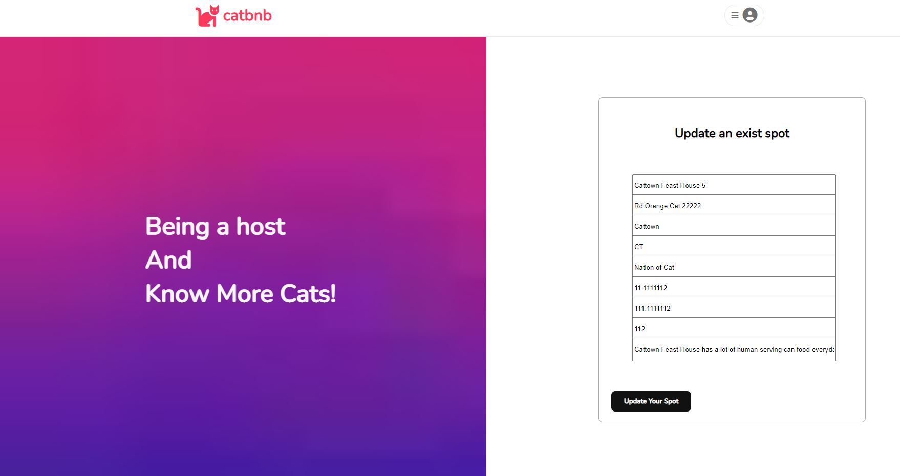

### Delete a Spot
When you are logged in, you can click any dustbin button in "My Spots" page, or also go to the detail page of a owned spot, then click the "delete" button, to delete a spot.

### Get my bookings
When you are logged in, you can click the "My bookings" button in the profile menu, and then see all the bookings already there.
The route for this page is '/mybookings'.

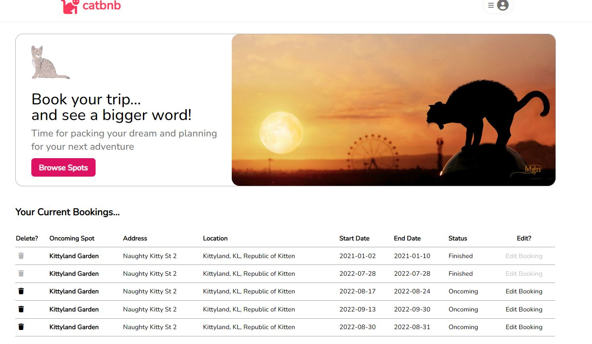

### Get bookings for a spot
When you are looking at a spot detail, you'll see the exist bookings for the spot.

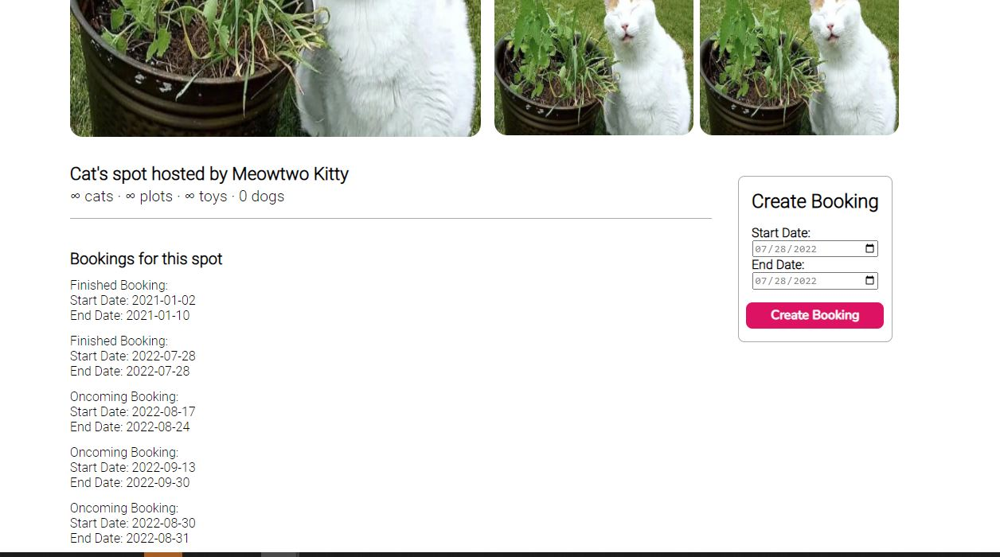

### Create a booking
When you are in a spot detail page, and you are not the owner of the spot, you can create a booking with the create booking table.

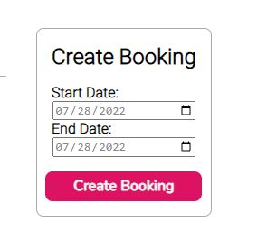

### Edit a booking
When you are in "My bookings" page, you can access the update booking table by clicking on any edit button. To close the table, you can click the "x".

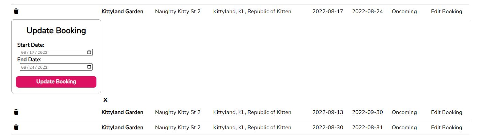

### Delete a booking

When you are logged in, you can click any dustbin button in "My Bookings" page, to delete a booking.
